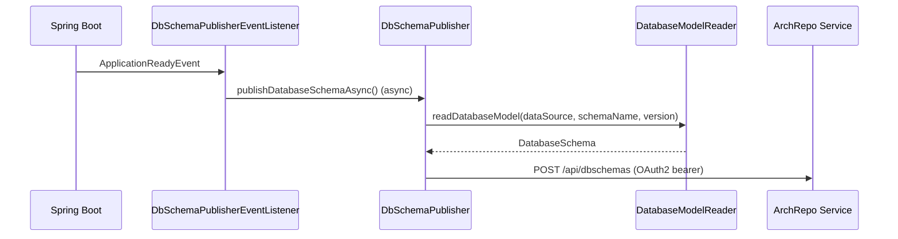

# How it works

The publisher hooks into the Spring Boot lifecycle to read and upload the database schema once the
application is ready, without affecting business logic or startup time.

## Startup flow

1. `DbSchemaPublisherEventListener` listens for the Spring `ApplicationReadyEvent`.
2. It calls `DbSchemaPublisher.publishDatabaseSchemaAsync()`, which is `@Async` on a dedicated
   single-thread task executor (`dbSchemaPublisherTaskExecutor`). The upload therefore runs in the
   background and never blocks startup.
3. `DatabaseModelReader` opens a JDBC connection from the application `DataSource` and reads the schema
   (named by `jeap.archrepo.database.schema-name`, default `data`) from `DatabaseMetaData`.
4. The result is wrapped in a `CreateOrUpdateDbSchemaDto` (the system component name is
   `spring.application.name`) and posted to the archrepo at `POST /api/dbschemas`.
5. The operation is optionally wrapped by `TracingTimer` in a Micrometer span (`publish-db-schema`) and
   timer (`jeap-publish-database-schema`, tagged `status=success|error`) when a `Tracer` and
   `MeterRegistry` are present.

The whole upload is best-effort: any exception is caught and logged as
`Failed to publish database schema`; the application keeps running.

## The schema model

`DatabaseModelReader` (module `jeap-db-schema-publisher-model-reader`) maps JDBC metadata into a set of
immutable records:

| Record            | Fields                                                                  |
|-------------------|-------------------------------------------------------------------------|
| `DatabaseSchema`  | `name`, `version`, `tables`                                             |
| `Table`           | `name`, `columns`, `foreignKeys`, `primaryKey`                          |
| `TableColumn`     | `name`, `type`, `nullable`                                              |
| `TablePrimaryKey` | `name`, `columnNames`                                                   |
| `TableForeignKey` | `name`, `columnNames`, `referencedTableName`, `referencedColumnNames`  |

Foreign keys that span multiple columns are grouped by foreign-key name. The `version` field is the
application version resolved by `AppVersionProvider` from `BuildProperties`, then `GitProperties`
(`git.build.version`), falling back to `na` if neither is available.

## Related

- [Getting started](getting-started.md)
- [Configuration reference](configuration.md)
- [Authentication](authentication.md)
- [jeap-db-schema-publisher](../README.md)
